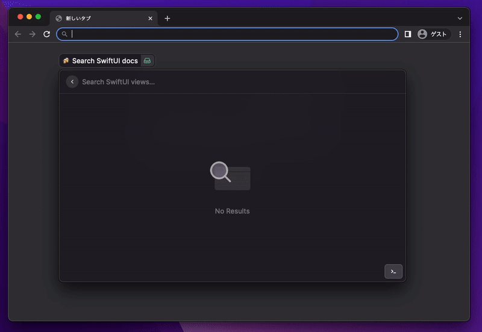

# Raycast SwiftOnTap🍻

## DEMO

## How to Install

- clone repo
- Run `Import Extension` Command in Raycast
- Select this repository path
- `npm install`
- `npm run build` (for unknown reason, you have to run this **after** importing)
